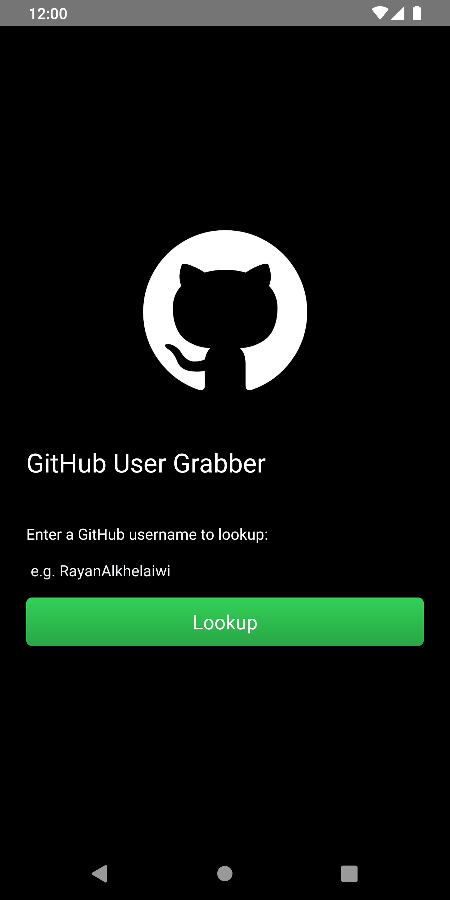
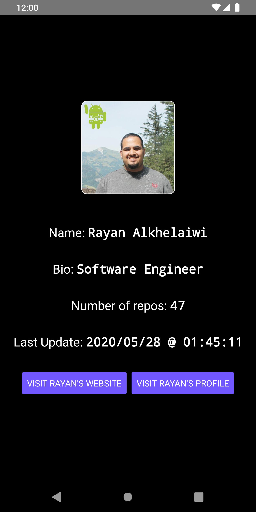
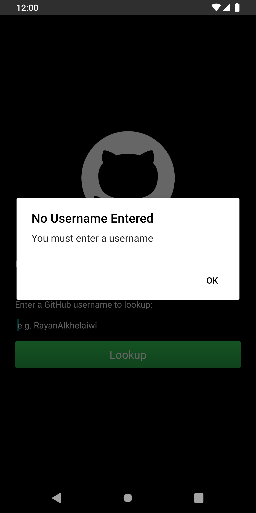
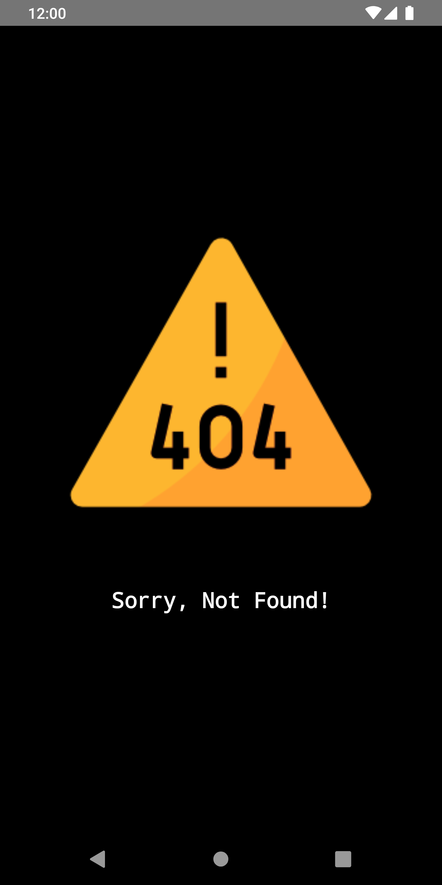

# Github User Grabber - React Native

React Native app that fetches GitHub's user profile information, via user handler, from GitHub API

Covers:

- [x] Multiscreens using [react-navigation](https://www.npmjs.com/package/react-navigation "react-navigation")
- [x] Third Party module for better UI using [react-native-linear-gradient](https://www.npmjs.com/package/react-native-linear-gradient "react-native-linear-gradient")
- [x] State Management using this/super(props) - w/ Option to use [Redux](https://redux.js.org/)
- [x] Integrate 3rd Party API (GitHub's) using fetch() - w/ Option to use [axios](https://github.com/axios/axios) (Since both are promise-based)
- [x] Basic Unit Testing using [Jest](https://jestjs.io/)
- [ ] Dockerize the React Native App and deploy it to [AWS Kubernetes Engine (EKS)](https://aws.amazon.com/eks/) - In Progress...

## Singed APK File
* Download the signed APK file [here](https://github.com/RayanAlkhelaiwi/GithubUserGrabber-ReactNative/raw/master/android/app/build/outputs/apk/release/app-release.apk)

## Project Structure

```sh
  ├── README.md
  ├── index.js ** First file to execute by React Native
  └── components
    ├── App.js ** Main file with StackNavigator multiscreen navigation
    ├── userGrabber.js ** Initial activity to enter a Github user to lookup
    └── userFetchedInfo.js ** Results activity with fetched info about the user
```

Initial Activity  |  Fetch User Info  |  Form Validation  |  Error Handling
:-------------------------:|:-------------------------:|:-------------------------:|:-------------------------:
  |    |    |  
